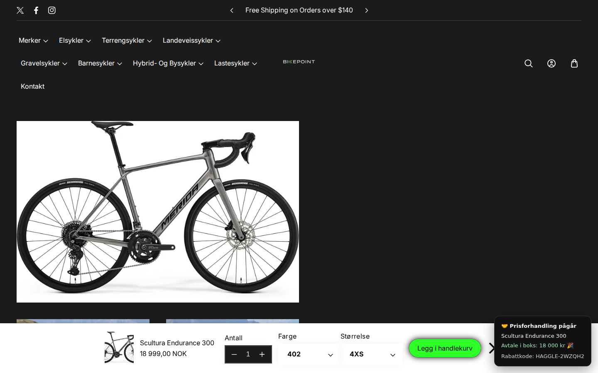

# Haggle — your AI haggles with our AI

[](https://github.com/noktohq/haggle/actions/workflows/ci.yml)

*English (primary) — [norsk utgave](README.no.md).*

**The first bike store where your agent negotiates the price.** Haggle adds
[WebMCP](https://github.com/webmachinelearning/webmcp) tools to a real Shopify
storefront so the customer's agent (ChatGPT's browser, or Chrome with WebMCP
enabled) can negotiate with the store's server-side AI seller — and the deal
becomes a real single-use Shopify discount code the human redeems in the normal
checkout.

Built for the [WebMCP Challenge](https://webmcp.devpost.com/) on
[Bikepoint](https://bikepoint-no.myshopify.com), a Shopify development
store with a real e-bike catalog. By [Nokto](https://nokto.no).



*A real negotiation on the live store: the buyer's agent talked the seller down
from 18 999 kr to 18 000 kr — the widget (bottom right) shows the deal and the
real single-use discount code the human applies in the normal checkout.*

**Try it live:** open [bikepoint-no.myshopify.com](https://bikepoint-no.myshopify.com)
(store password `haggle`) in ChatGPT's in-app browser, go to any product page
and ask your agent to get you a better price. (Chrome's
`chrome://flags/#enable-webmcp-testing` exposes the WebMCP surface so the tools
register, but stock Chrome ships no agent that drives them — pair it with a
WebMCP-driving agent/extension, or use ChatGPT's browser for the full loop.)

## Why this needed WebMCP

Price negotiation on the web has never existed at scale because it required a
human on both ends. WebMCP removes exactly that constraint: the store exposes a
*negotiation protocol* as tools — not just CRUD — and the browser's agent
represents the buyer, while the human stays in charge of the final handshake.

```
Human ──> Agent (ChatGPT browser / Chrome)          Store (Shopify theme)
             │  WebMCP: document.modelContext          │  webmcp-haggle.js
             │  list_negotiable_products               │
             │  start_negotiation ──────────────────>  │──> Haggle server (Cloud Run)
             │  make_offer  <── counteroffers ───────  │      • secret price floor
             │  accept_deal ─────────────────────────> │      • Claude phrases the seller
             │                                         │      • Shopify Admin API mints
             └──> human applies discount code at real checkout   a single-use discount code
```

## The tools agents see

| Tool | What it does |
|---|---|
| `list_negotiable_products` | Catalog with handles and listed NOK prices |
| `start_negotiation` | Opens a session with the AI seller for one product |
| `make_offer` | Bids in NOK; seller accepts, rejects or counteroffers (max 6 rounds) |
| `get_negotiation_state` | Current offers, rounds, status |
| `accept_deal` | Locks the deal → returns a real single-use discount code |

Safety by structure: the price floor (`MAX_DISCOUNT_PCT`, default 10 %) is
enforced server-side and never leaves the server. The optional Claude "voice"
only phrases messages — every number it may utter is computed and clamped
deterministically first, and replies that don't quote the authoritative price
are discarded. No key? A deterministic Norwegian template voice takes over.

## Repository layout

```
server/       zero-dependency Node 20 negotiation service (+ Dockerfile)
storefront/   webmcp-haggle.js theme snippet · INSTALL.md · standalone demo.html
e2e/          Playwright suite driving the WebMCP tools like an agent would
scripts/      smoke.sh — black-box HTTP negotiation, same script CI runs
docs/         WebMCP API notes with sources
```

## Reproducible testing (no accounts needed)

```bash
cd server
npm test                                   # negotiation engine test suite
npm ci && npm run typecheck                # strict tsc over the JSDoc-typed source
MOCK_PRODUCTS=1 node src/index.js          # runs on :8080 with a fixture catalog
```

Then negotiate over HTTP:

```bash
curl -s -X POST localhost:8080/api/session -H 'Content-Type: application/json' \
     -d '{"productHandle":"demo-ecoride-tripper"}'
curl -s -X POST localhost:8080/api/offer -H 'Content-Type: application/json' \
     -d '{"sessionId":"<id>","offerNOK":30000}'
curl -s -X POST localhost:8080/api/accept -H 'Content-Type: application/json' \
     -d '{"sessionId":"<id>"}'
```

Or let the machines do it: `bash scripts/smoke.sh` runs that exact loop, and
`cd e2e && npm ci && npx playwright test` plays the buyer's agent in Chromium
against the real storefront script — the same checks CI runs on every push to
main and on every PR.

Or serve `storefront/` statically (e.g. `npx http-server storefront`) and open
`demo.html` in a WebMCP-enabled browser while the mock server runs — the server
accepts localhost origins out of the box, and `?api=<url>` points the page at
any other server.

## Production setup

1. Deploy the server: `gcloud run deploy haggle --source server --region europe-north1 --allow-unauthenticated`
2. Set env vars (see `.env.example`): `SHOPIFY_STORE_DOMAIN`, `SHOPIFY_ADMIN_TOKEN`
   (custom app with `read_products` + `write_discounts`), `MAX_DISCOUNT_PCT`,
   optional `ANTHROPIC_API_KEY`.
3. Install the theme snippet: see `storefront/INSTALL.md`.

Note: on Cloud Run's `*.run.app` domain, `GET /healthz` is intercepted by
Google's frontend before it reaches the container (you get Google's HTML 404).
Probe `POST /api/session` for production health checks; `/healthz` works
locally and in CI.

## Engineering notes

- **Zero-dependency runtime.** `server/` runs on plain Node 20 — `node src/index.js`
  is the whole deploy. `typescript` and `@types/node` are dev-only, for checking.
- **Typed without a build step.** The server source is JSDoc-annotated JS under
  `// @ts-check`; `npm run typecheck` runs `tsc --checkJs --noEmit` in strict mode.
- **The WebMCP surface is e2e-tested.** Playwright loads the real `demo.html`, shims
  `document.modelContext` the way an agent runtime would, captures the registered
  tools and plays the buyer's agent through a full negotiation (`e2e/`).
- **Price floor by structure, not by prompt.** The floor exists only inside the
  deterministic engine. Unit tests hammer it (never breached, never leaked), and
  both the smoke script and the e2e suite re-assert the bounds over the wire.

## License

MIT © Nokto
